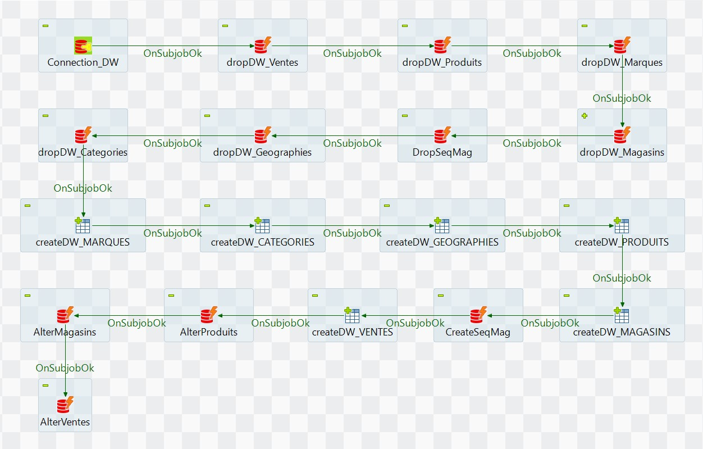
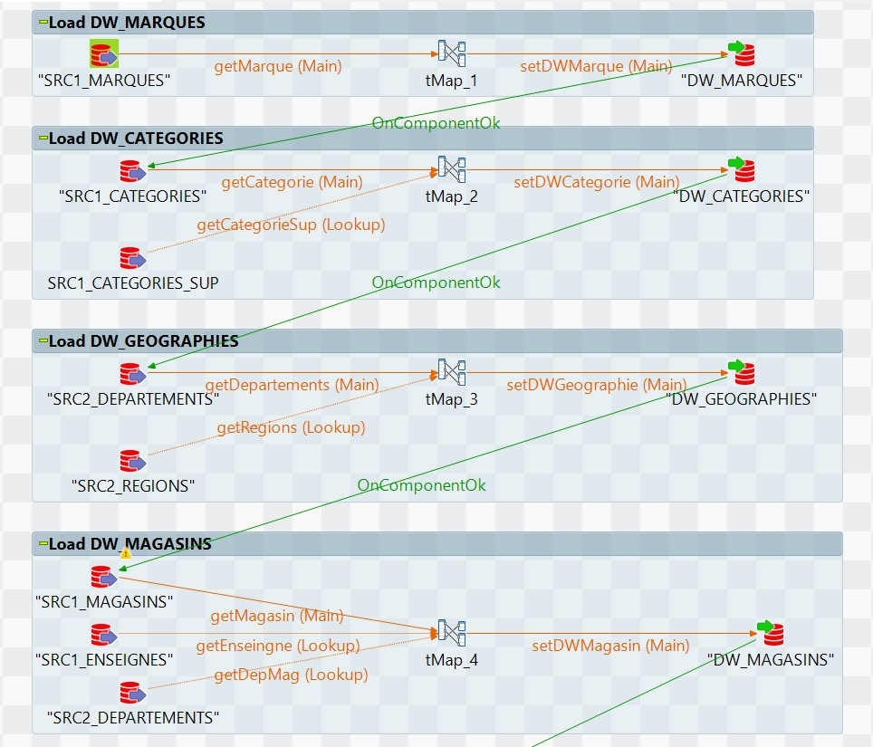
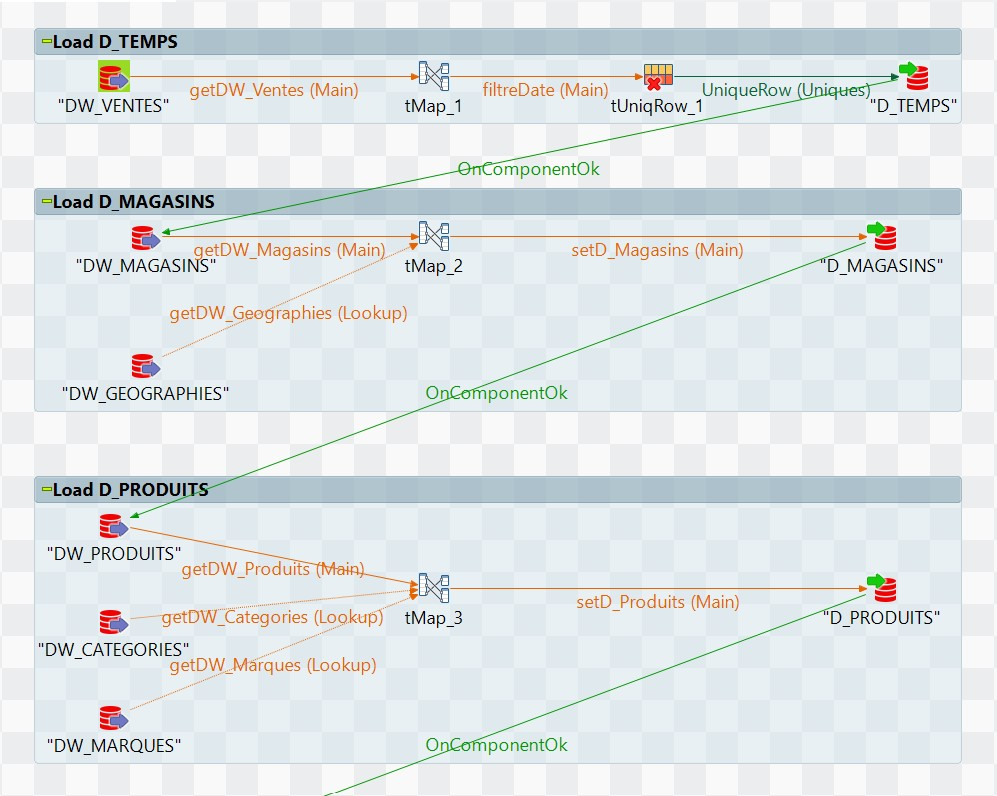

[Accueil](index.md) | [Projets](projets.md) | [Expérience](experience.md) | [Compétences](competences.md) | [Formation](formation.md) | [Contact](contact.md)

# 📂 Mes projets académiques

Voici une sélection de projets réalisés durant mon **BUT Sciences des Données et mon Master MIAGE**.

---

## Projet Data – Analyse des données Open DAMIR
  
📅 **Date :** Avril 2026  
🏫 **Université :** Université Toulouse Capitole  
📍 **Lieu :** Toulouse, France  

---

### 🎯 Objectif

Mettre en place une **architecture médaillon (Bronze - Silver - Gold)** afin d’optimiser le stockage, la transformation et l’analyse de données de santé à grande échelle.

Le projet porte sur le **traitement et l’analyse des datasets massifs de remboursements de soins de l’Assurance Maladie (Open DAMIR)** couvrant la période **mai 2015 à mai 2025**, représentant environ **200 millions de lignes par mois**.

---

### 🤖 Architecture et pipeline de données

Mise en place d’un **pipeline de données basé sur l’architecture Bronze - Silver - Gold** afin de transformer les données brutes en datasets analytiques optimisés.

---

### 🛠️ Technologies utilisées

#### DuckDB
Utilisation de **DuckDB** pour :
- Stocker localement des datasets volumineux
- Interroger efficacement les données analytiques
- Exécuter des transformations SQL sur des fichiers Parquet

#### Modélisation des données
Conception d’un **modèle en étoile (Star Schema)** afin de structurer :

  

---

### 📊 Visualisation et analyse

Création de **tableaux de bord Power BI** permettant :

- l’analyse des **dépenses de la CPAM**
  
  
  
- l’étude du **recours aux soins des patients**
  
- l’exploration temporelle et territoriale des remboursements

---

### Résultats attendus

- Pipeline de données reproductible et scalable
- Amélioration des performances d’analyse sur des datasets massifs
- Visualisation claire des tendances de dépenses de santé
- Support à l’analyse du système de remboursement de l’Assurance Maladie

---

### Volume de données

- **Période analysée :** 2015-05 → 2025-05  
- **Volume mensuel :** ~200 millions de lignes  
- **Formats utilisés :**
  - Source : `.csv.gz`
  - Analytique : `.parquet`
  

➡ Voir le projet : [projets/projet_data_engineering/](https://github.com/Brusny/monportfolio/tree/main/projets/projet_data_engineering)

---

## Projet Data Integration ETL

📅 **Date :** 2026  
🏫 **Université :** Université Toulouse Capitole  
📍 **Lieu :** Toulouse, France  

---

### 🎯 Objectif

Mise en œuvre d’un projet complet de **Data Integration ETL** avec **Talend Open Studio** visant à :

- intégrer plusieurs sources de données hétérogènes,
- construire un **entrepôt de données (Data Warehouse)**,
- créer un **magasin de données (Data Mart)**,
- automatiser les flux ETL,
- permettre l’analyse décisionnelle via un outil OLAP.

Le projet s’appuie sur deux bases de production Oracle :

- **Production 1** : données commerciales et ventes
- **Production 2** : données géographiques françaises

---

### 🏗️ Architecture du projet

  

### 🗄️ Mise en place de l’entrepôt de données sous Talend
La préparation de l’entrepôt de données a été réalisée directement dans Talend afin de configurer l’environnement technique et les différents objets nécessaires au projet. Les connexions à la base de données ainsi que les schémas des tables ont été importés dans les métadonnées Talend pour faciliter la création et l’exploitation de l’entrepôt.
    
La création des tables a été effectuée à l’aide des composants `tCreateTable`. Toutefois, ces composants ne permettant pas la création des clés étrangères, celles-ci ont été ajoutées séparément via des instructions ALTER TABLE exécutées à l’aide des composants `tDBRow` et `tOracleRow`.
    
Les captures d’écran suivantes présentent les différentes configurations et composants utilisés dans Talend pour la mise en place de l’entrepôt de données.
  

### 🔄 Extraction et alimentation de l’entrepôt de données
Cette étape consiste à mettre en œuvre les processus d’extraction et de chargement des données sources afin d’alimenter l’entrepôt de données. Les différents jobs Talend ont été développés en respectant l’ordre d’alimentation imposé par les relations entre les tables et les clés étrangères.

Chaque alimentation a été réalisée à l’aide de composants Talend dédiés à l’extraction, à la transformation et au chargement des données, puis vérifiée à l’aide de requêtes de contrôle afin de garantir la cohérence et l’intégrité des données intégrées dans l’entrepôt.

Les captures d’écran suivantes présentent les jobs Talend utilisés pour l’alimentation des différentes tables de l’entrepôt de données.
  

### 🏬 Création et alimentation du magasin de données

Cette partie présente la mise en place du magasin de données à partir de l’entrepôt de données précédemment alimenté. Le magasin a été conçu selon une modélisation multidimensionnelle en étoile afin de faciliter l’analyse décisionnelle et l’exploitation des indicateurs métiers.

La table de faits `F_VENTES` centralise les mesures principales, tandis que les tables de dimensions `D_TEMPS`, `D_PRODUITS` et `D_MAGASINS` permettent d’analyser les ventes selon différents axes. Les traitements d’alimentation ont été réalisés sous Talend à l’aide de jobs ETL dédiés à l’extraction, à la transformation et au chargement des données.

Le schéma ci-dessous illustre la structure multidimensionnelle du magasin de données ainsi que les relations entre les différentes dimensions et la table de faits.

  
➡ Voir le projet : [projets/projet_data_integration](https://github.com/Brusny/monportfolio/tree/main/projets/projet_data_integration)

---

## Projet Machine Learning – Prédiction d’acceptation de crédit  

📅 **Date :** Mars 2026  
🏫 **Université :** Université Toulouse Capitole  
📍 **Lieu :** Toulouse, France  

### 📌 Description

Développement d’un **pipeline de classification** pour prédire l’acceptation de prêts bancaires à partir de **données clients**.

---

### ⚙️ Prétraitement des données

- Encodage des **variables catégorielles**
- Gestion des **valeurs manquantes**
- **Standardisation** des variables

---

### 🔎 Sélection des variables

- Utilisation de **Feature Selection** pour identifier les variables les plus pertinentes.

---

### 🤖 Modèles de Machine Learning

Entraînement et comparaison de plusieurs modèles :

- **SVM (Support Vector Machine)**
- **KNN (K-Nearest Neighbors)**
- **Régression Logistique**
- **Decision Tree**
- **Random Forest**
- **XGBoost**
- **MLP (Multi-Layer Perceptron)**

---

### 🎯 Optimisation des hyperparamètres

- Recherche des meilleurs paramètres avec **GridSearchCV**.

---

### 📊 Évaluation des performances

Les modèles sont évalués à l’aide des métriques suivantes :

- **Accuracy**
- **Precision**
- **Recall**
- **F1-score**

---

### 🛠️ Technologies utilisées

- **Python**
- **Pandas**
- **NumPy**
- **Scikit-learn**
- **XGBoost**
- **Seaborn**

➡ Voir le projet : /projets/pipeline-data
